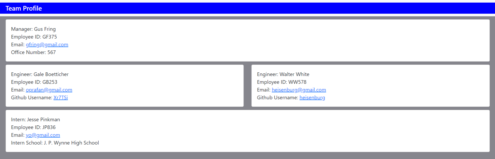

 # 

  # Team-Profile-Generator

  ## Contents:
  #### [Description](#description:)
  #### [Installation](#installation:)
  #### [Usage](#usage;)
  #### [Tests](#tests:)
  #### [Questions](#questions:)
  #### [License](#license:)
  &nbsp;

[See Team Profile Generator on GitHub](https://github.com/Xr7TSi/Team-Profile-Generator)

  
  ## Description: 

  #### This application constructs a Team Profile HTML file based on user input.
  &nbsp;

  ## Installation: 

  #### From the command line, run npm install inquirer. 
  #### Invoke the application with the command "node index.js."
  &nbsp;

  ## Usage: 

  #### See this link for an application demo: https://drive.google.com/file/d/1U97BHvOZw7_nLGU2VzB0oAHIlev087Bg/view
  &nbsp;

  ## Tests: 

  #### From the command line,  run npm init -y,  then  npm install --save-dev jest.
  #### In package.json, update "test": "echo \"Error: no test specified\" && exit 1" to "test": "jest".
  #### Run test from the command line with command: npm test.
   #### See this link for testing demo: https://drive.google.com/file/d/1ML9wx8kqKmbNPWEB_F85NMpFfuGSlaTV/view
  &nbsp;
  
  ## Questions?

  #### Github: https://github.com/Xr7TSi
  #### Email me at jrein1296@gmail.com for any additional questions.
  &nbsp;

  License:
  #### Mozilla
  #### https://opensource.org/licenses/MPL-2.0